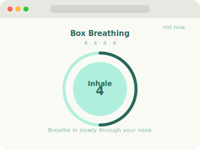
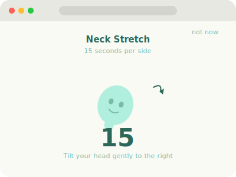
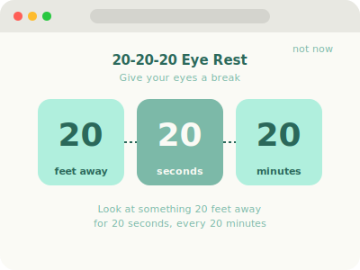
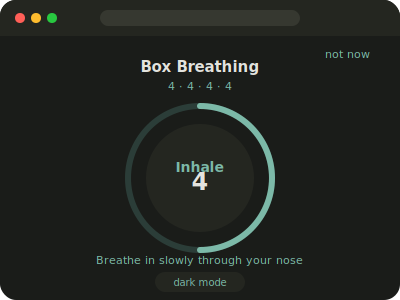

# claude-pause

**Scheduled breaks, exactly when the moment is right.**

Wellness hooks for Claude Code. Get guided breathing, stretching, and eye-care exercises in your browser when Claude is doing long work.

---

## Preview

<p align="center">
  
  
</p>
<p align="center">
  
  
</p>

---

## What happens

When Claude starts a slow build, test run, or agent task, claude-pause opens a full-page interactive wellness guide in your browser. It cycles through 8 exercises in order, with a configurable cooldown between breaks (default: 60 minutes) — so you're never interrupted more than necessary.

---

## Install

**With Homebrew (macOS):**

```bash
brew tap eIlluz/claude-pause
brew install claude-pause
```

**Or manually:**

```bash
git clone https://github.com/eIlluz/claude-pause.git
cd claude-pause
bash install.sh
```

This copies files to `~/.claude/scripts/` and merges the necessary hooks into `~/.claude/settings.json`.

---

## What triggers a break

- **Slow Bash commands** — build, test, install, docker, deploy, and [more](#customize)
- **Agent launches** — when Claude spins up a subagent task
- **MCP server calls** — external API integrations via Model Context Protocol

All triggers share the same 60-minute cooldown, so you won't be interrupted mid-flow.

---

## Customize

Config lives at `~/.claude/scripts/wellness.config.json`:

| Field | Description |
|---|---|
| `cooldown_minutes` | Minutes between breaks (default: `60`) |
| `open_browser_card` | Toggle browser cards on/off (`true`/`false`) |
| `hooks.bash` | Enable/disable Bash command trigger |
| `hooks.agent` | Enable/disable agent launch trigger |
| `hooks.mcp` | Enable/disable MCP call trigger |
| `slow_keywords` | List of command substrings that count as "slow" |
| `prompts` | Add, remove, or reorder the exercise sequence |

---

## Dark mode

Cards automatically switch to a dark, calming palette when your system is set to dark mode. The dark theme uses a deep forest background (`#1a1c19`) with muted teal accents — easy on the eyes whether you're working in a bright office or a dim room late at night.

---

## Smart cooldown

The cooldown adapts to how long you've been in a session:

- **First 30 minutes** — no breaks trigger, so you can settle in without interruption.
- **After 30 minutes** — normal cooldown applies (default: 60 minutes between breaks).
- **After 2+ hours** — break frequency doubles, nudging you to move more during long sessions.

Adjust the base cooldown in `~/.claude/scripts/wellness.config.json` via the `cooldown_minutes` field.

---

## History

Every exercise that completes is logged to `~/.claude/scripts/.wellness_history.json`. Each entry records the timestamp, exercise name, and trigger type (bash / agent / mcp), so you can track your break habits over time.

---

## Custom exercises

Add your own exercises by copying `cards/TEMPLATE.html` and filling in the placeholders. Then register the new card in `~/.claude/scripts/wellness.config.json` under the `prompts` array. The template includes all the standard UI (skip button, dark-mode support, completion sound) wired up and ready to go.

---

## Skip

Every card has a **not now** button in the top-right corner. Clicking it closes the card immediately and resets the cooldown timer, so you won't be prompted again until the full cooldown has elapsed.

---

## The exercises

| Exercise | Description |
|---|---|
| Box Breathing | 4-4-4-4 breathing cycle with animated visual guide |
| Neck Stretch | Guided 15s per side with tilt animation |
| 20-20-20 Eye Rest | Look 20ft away for a 20s countdown |
| Posture Check | 4-point alignment checklist |
| 4-7-8 Breathing | Asymmetric calming breath (inhale 4, hold 7, exhale 8) |
| Shoulder Roll | 5x forward, 5x backward with rotation animation |
| Blink Reset | Close eyes 10s, then rapid blink 10x |
| Spine Stretch | Stand, reach overhead, fold forward with progress timer |

Cards are self-contained HTML files — no internet connection required.

---

## Uninstall

```bash
bash uninstall.sh
```

---

## How it works

Claude Code hooks trigger `wellness.sh` before tool calls. The script reads `wellness.config.json`, checks whether enough time has passed since the last break, and for Bash commands filters by keyword to distinguish slow operations from quick ones. If a break is due, it picks the next exercise in sequence and opens the matching HTML card in your default browser. Each card is a standalone vanilla HTML/CSS/JS file with animated exercises and no external dependencies.

---

## Requirements

- macOS or Linux
- Claude Code
- Python 3 (ships with macOS)

Zero npm, brew, or pip dependencies.

---

## License

MIT
